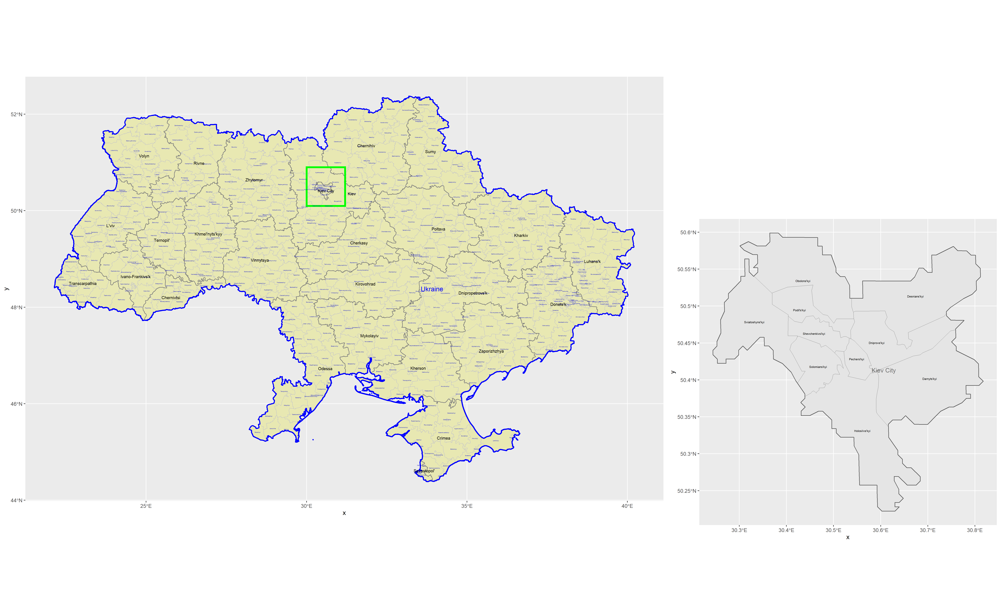
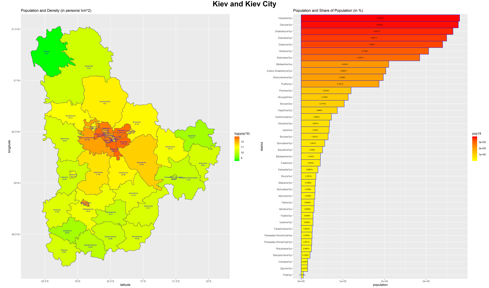
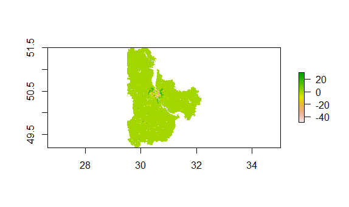
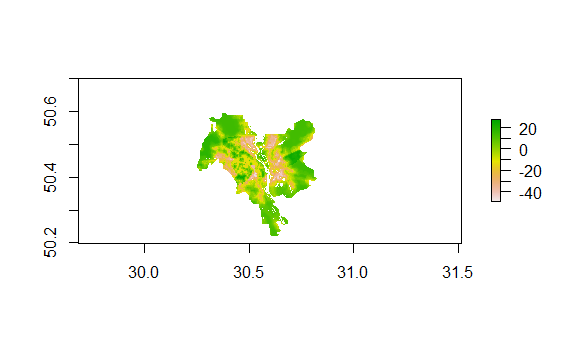
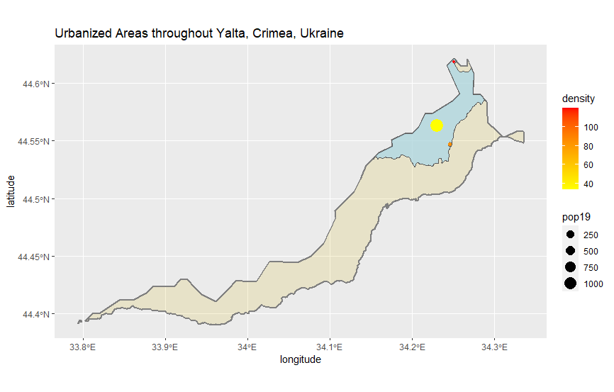
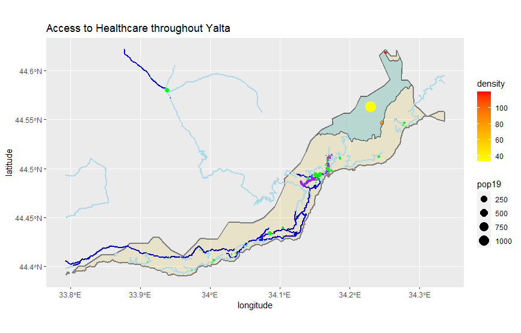
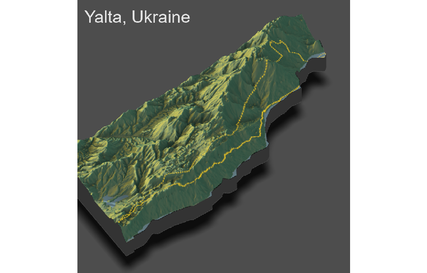
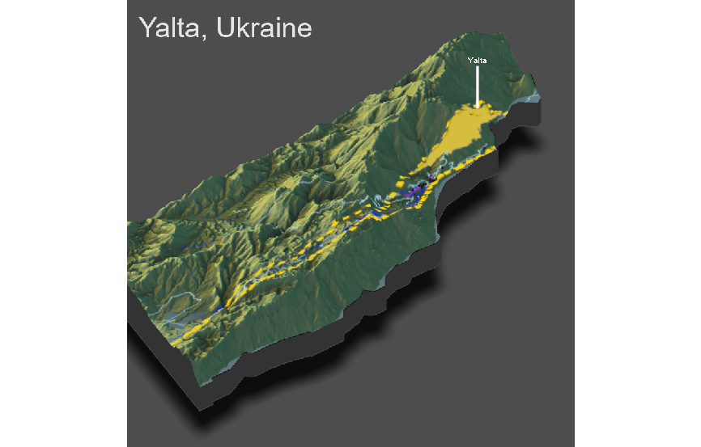
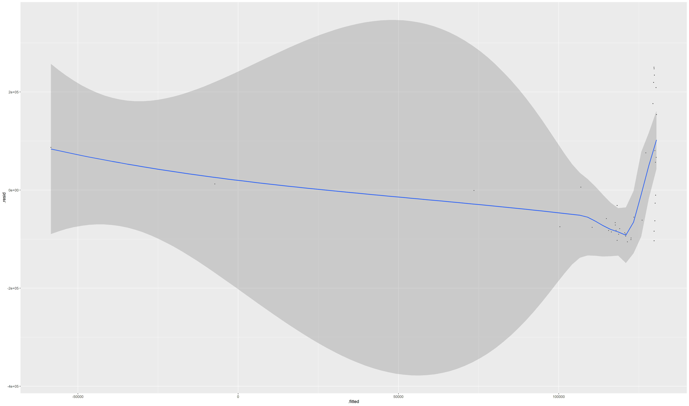
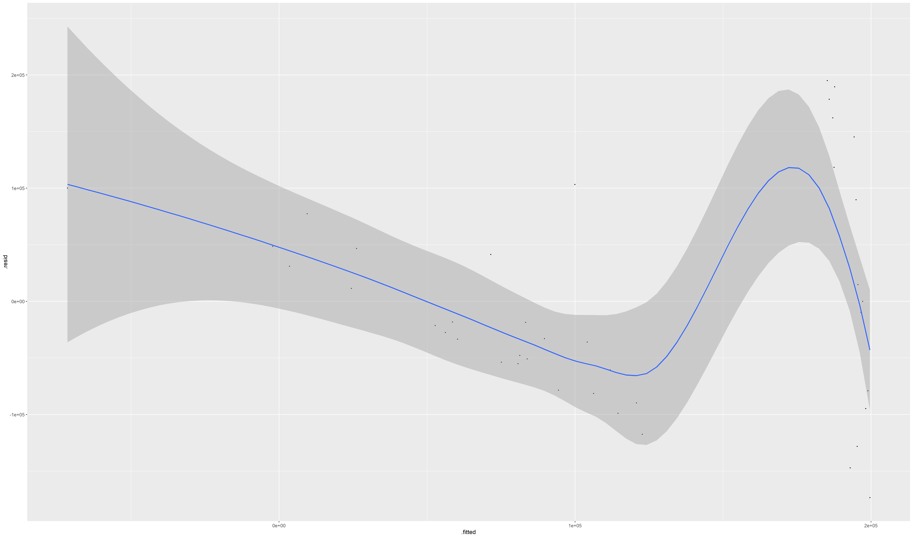

# Final Conclusions
## Ignat Miagkov

### Part 1: Administrative Subdivisions of Ukraine
 

### Part 2: Population Distribution in Kiev

### Part 3: Access to Roadways and Healthcare in Yalta

### Part 4: Further Analysis Based on Topography of Yalta

### Final Analysis
  Ukraine is a lower middle income country located in Eastern Europe. With very strong ties with the former Soviet Union, most of its economy is heavily dependent on Russian support. Ukraine's first adminstrative divisions are called oblasts, which are either city municipalities or simlar to American states. Ukraine's second administrative divisions are called raions, or are the equivalent of districts. Ukraine runs a unitary systems, which means all the shots for the whole country are still being called from Kiev, the capital city. For our population model and study, we shall be focusing on Kiev and its surrounding districts. 
  
  We created a model to estimate the population of Kiev City and the surrounding districts that make up the Kiev Oblast district. We used several different factors, such as urban cover and nighttime lights, to estimate the population and compare it to the actual values. Here are some regressions that were created.
  

Regression statistics for these models are listed under project 2.

  The more factors we incorporated into our model, such as urban cover and nighttime lights, the more accurate our model got to the actual values, and less variation was detected between samples. However, this does prove that the rural landscape of the surroudning regions of Kiev are less developed than the city itself. 

