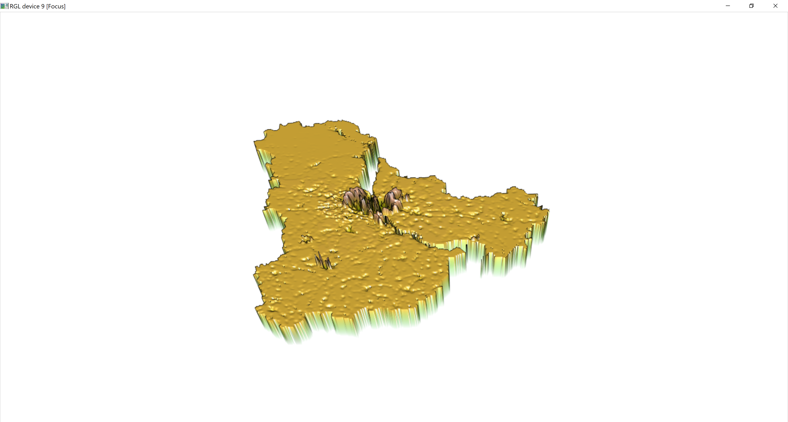

# Final Conclusions
## Ignat Miagkov

### Part 1: Administrative Subdivisions of Ukraine
 

### Part 2: Population Distribution in Kiev

### Part 3: Access to Roadways and Healthcare in Yalta

### Part 4: Further Analysis Based on Topography of Yalta

### Final Analysis
  Ukraine is a lower middle income country located in Eastern Europe. With very strong ties with the former Soviet Union, most of its economy is heavily dependent on Russian support. Ukraine's first adminstrative divisions are called oblasts, which are either city municipalities or simlar to American states. Ukraine's second administrative divisions are called raions, or are the equivalent of districts. Ukraine runs a unitary systems, which means all the shots for the whole country are still being called from Kiev, the capital city. For our population model and study, we shall be focusing on Kiev and its surrounding districts. 
  
  We created a model to estimate the population of Kiev City and the surrounding districts that make up the Kiev Oblast district. We used several different factors, such as urban cover and nighttime lights, to estimate the population and compare it to the actual values. Here are some regressions that were created.
  

Regression statistics for these models are listed under project 2.

  The more factors we incorporated into our model, such as urban cover and nighttime lights, the more accurate our model got to the actual values, and less variation was detected between samples. However, this does prove that the rural landscape of the surroudning regions of Kiev are less developed than the city itself. 
  
 
  
  This image displays the predicted values from our model using all of the factors available to us. The area outside the city is very well predicted: this is because there is no major fluctuations in the large surrounding land mass in terms of population, thus the factors in those areas will follow a general trend. However, in the very densily populated city area, the variation is much greater, because due to the sharp increase in people, our factors do not have as much an impact on the model, and the sheer squeezing of people prevails in the prediction. Based on our model and population study of Kiev, Kiev is a well developed city, one that does manage to support a lot of people based on the factors that were presented to us. However, the surrounding rural landscape still has areas of human development to work on.

  For the last part of the project, I decided to focus in on Yalta, one the sites of meetings between allied leaders during World War II. I decided to switch my location drastically due to the appropriate population of the area: my hardware was able to process the data for the approximately 130 thousand people living there. Additionally, I tried to study if the Russian influence and annexation of the area (Yalta is in Crimea) has had any impact on human development since 2014. 
  
  Firstly, I attempted to distiguish the urban and more developed areas of Yalta. Unfortunately, I was only able to generate one urban area in my map on Yalta, and this is due to the fact that Yalta is a very urban area and is relatively heavily populated for its size. It is a very narrow district and does have many residents living within its borders. My main urban area that I was able to distinguish is in the nortwest corner of the district, and I was able to confirm this data with a satellaite image of the area. 
  
  
  
  Out of the ~130 thousand people living in Yalta, about 100 thousand of them live in that northwest corner of the district, which is the main part of the city. Looking at the roadways, Yalta is well developed area. The road network is substantial, and although my image does not display any roads in the main urban area, this is because they are much smaller roads, and my image displays the larger highways that give access to the rest of the region. Additionally, most health care services are located along those major roads. Looking at the topography of the region, the weird layout of the roads and healthcare being clustered in one area of the region makes sense: the mountainous terrain of the area forces for healthcare to be segregated to one cluster of the region. The road network is substantial though, and provides good access to the healthcare services in the region.
  
  Throughout my study of Ukraine, I have determined that for a lower middle income country, Ukraine is well developed. But this is mainly due to Russian interferance in the country. The population is well distributed, the capital city of Kiev is well supported. THe road network is well developed and despite a mountainous terrain, access to healthcare is sufficient. However, this is all mainly due to Russian support, and hopefully in the near future, Ukraine can become a more independent country, because the potential is definitely there.
