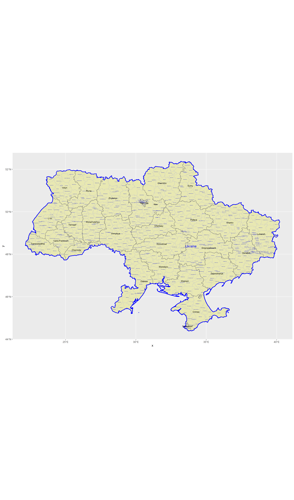
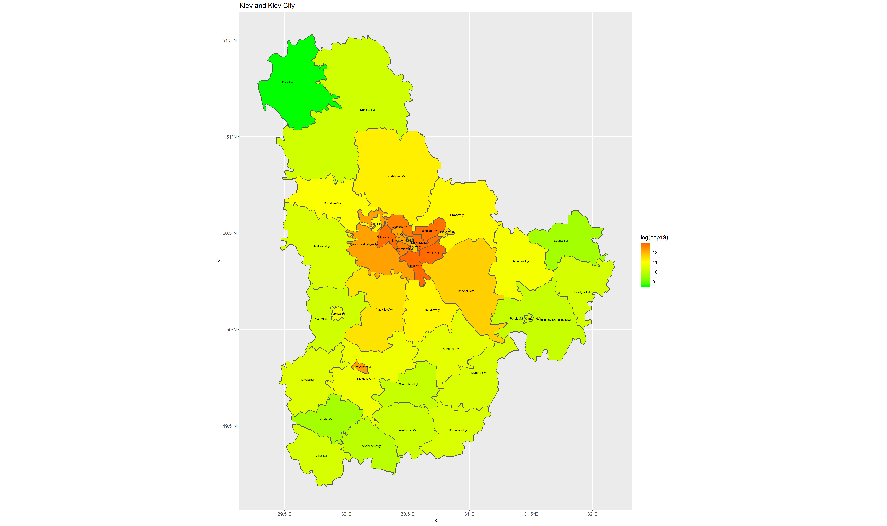
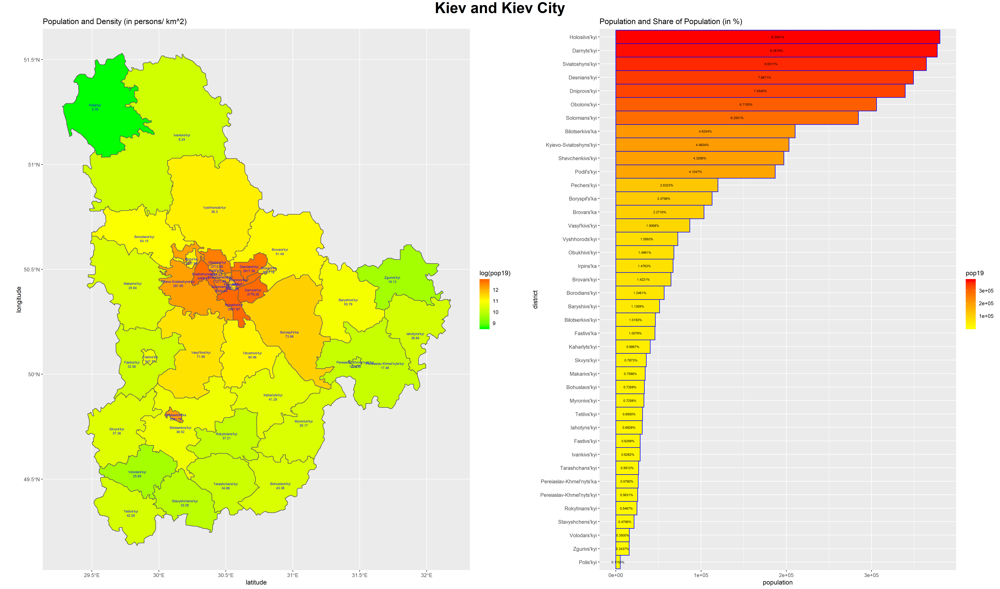

# Project 1 
## Ignat Miagkov

### Part 1: Administrative Subdivisions of Ukraine

  For the first part of this project, I was able to generate a map of the administrative subdivisions of Ukraine. The map displays the international border, 1st level borders, and 2nd level administrative borders of Ukraine by using data from a GADM shapefile. The biggest challenge for this part was initially my image was not large enough, and it was very hard to read the text of some of the districts (especially near the capital area). I was able to create a map with larger dimensions so that it was easier to read the text. Additionally, I did attempt to create a map with an detail inset of the capital region of Kiev and it will be attached below.
 

### Part 2: Population of Kiev and Kiev City Subdivisions

  For the second part of the project, I disaggregated a raster file to plot the population distribution of Ukraine's Kiev and Kiev City 1st level administrative districts. The hardest part of this part was Ukraine's size placed some restricitions on how much of the country I could plot, as my hardware would take forever to process the 208 million gridcells of the entire country. On this map, the logarithm of the population is used to display a greated degree of variation between the subdivisions. Unfortunately, I was unable to make the 3D illustration, as I ran into some problems extracting required packages.

### Part 3: Creating a Bar Plot and Population Map Side by Side

  For the final part, I created a bar plot to correspond with the distribution of the population throughout Kiev and Kiev City. Additionally, the density of each administrative subdivision of Kiev is displayed underneath each corresponding name. When it came to this part of the project, the biggest challenge ininiially was being able to recover my script from part 2, which I lost right after I finished :/ . Afterwards, this part went pretty smoothly and I was able to bring a strong end point to this exploration of Ukraine.

