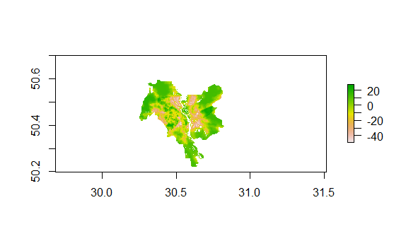
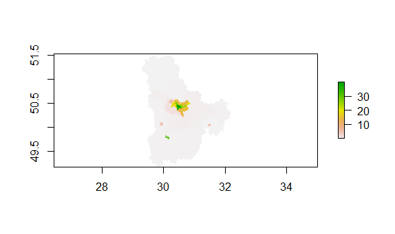
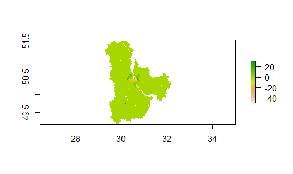
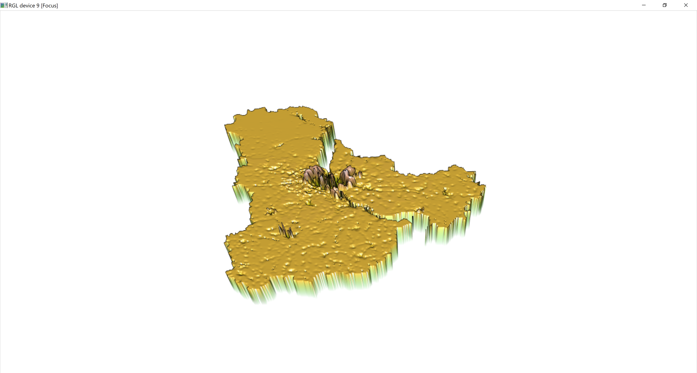
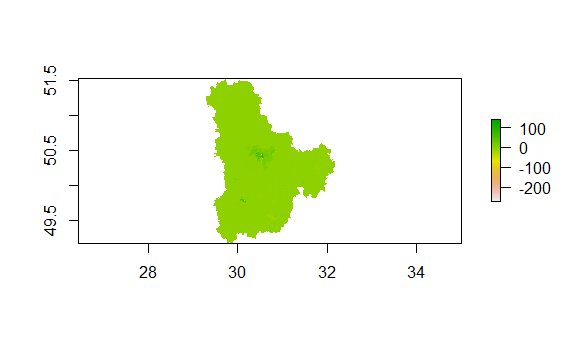
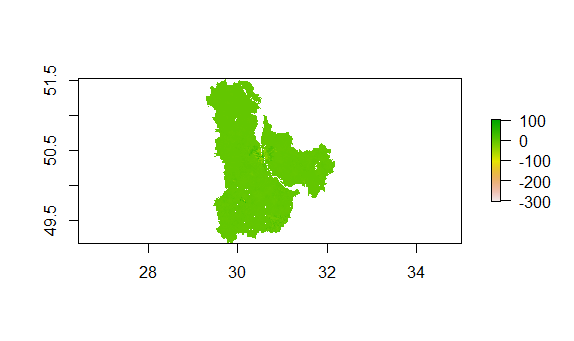
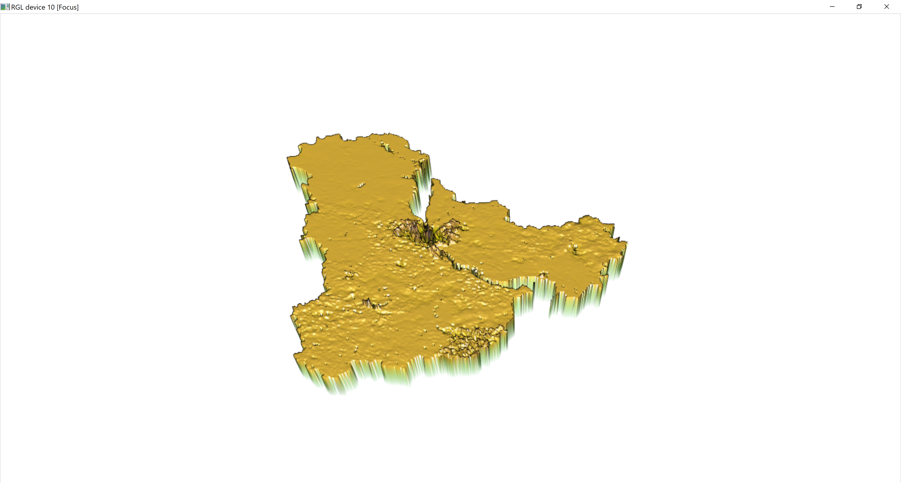

# Project 2
## Ignat Miagkov
### Part 1: Regressions

.png)
  These first three graphs are histograms combined with a distribution curve that best estimates the dependent factor based on the independent data. The first graph is the density of the population based on urban cover. The second graph is the density of the population based on night-time lights. The last graph is the density of the population based on the logarithm of the population. The last graph should have the most accurate predictor as it is making a model based directly on a population statistic.
  

[Regression Statistics](pop19_dst190_ntl.txt)
  This is a linear model predicting population density based on urban cover and night time lights. This model plots the differences (residuals) from the actual data. Regression statistics are linked in the link above. Overall, this is an okay predictor of population based on these factors in the Kiev and Kiev City districts.
  

[Regression Statistics](pop19_water_dst190_topo.txt)
  This is a linear model predicting population density based on urban cover, surrounding bodies of watre, and topography of the region. This is a much bettter predictor than the previous linear model as it uses more factors to determine and predict the density of a certain gridcell. 
  
### Part 2: Modeling and Predicting Spatial Data

  The first image is the plotted difference in population density between the model and the actual values in the Kiev Oblast. As we can see, the model does a pretty good job predicting the population outside the main city, but there is a lot more variation inside the very urban area. The second image is the same data, but displayed over a road map of the region.
  

  The first image is the plotted difference in population density between the model and the actual values in Kiev City. As noted above, there is a lot more variation of population in the city, and the model is not 100% accurate for explaining the said variations in the city. The second image is the same data, but displayed over a road map of the city.
  
### Part 3: Investigating and Comparing Results

  The three above images display the predicted population and difference between the predicted and actual using the sum of each administrative subdivision as the predictor. As we can see, the surrounding area is well predicted by this set of predictors, while in the city the increased variation within the populace results in a less-well explained area.
 

  The first image displays the predictied populations of the subdivisions using means of the subdivisions as the main predictor in our model. The second image displays the difference between the predicted and the actual, while the last image is the same as the second but a 3D representation. As seen previously, our model does a good job outside the city, but once more extraneous variables are introduced in the city, the variation between the model and the actual increases.
  

