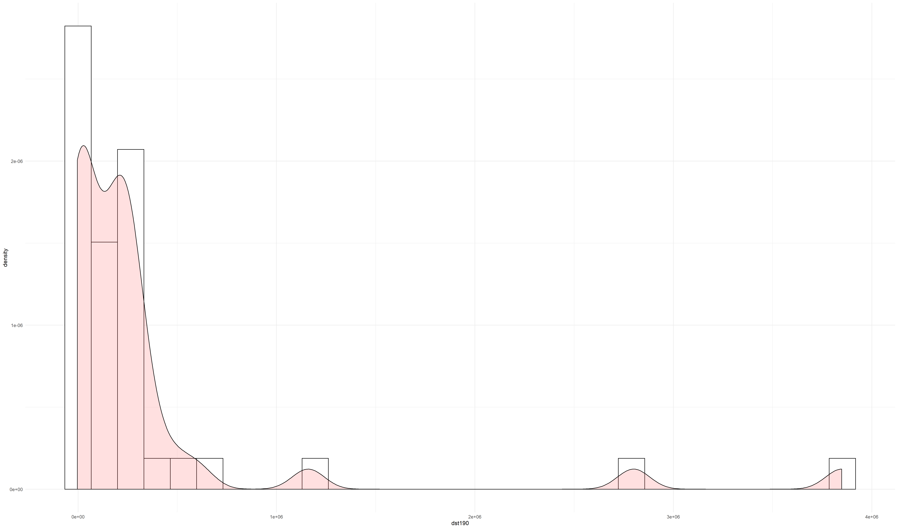
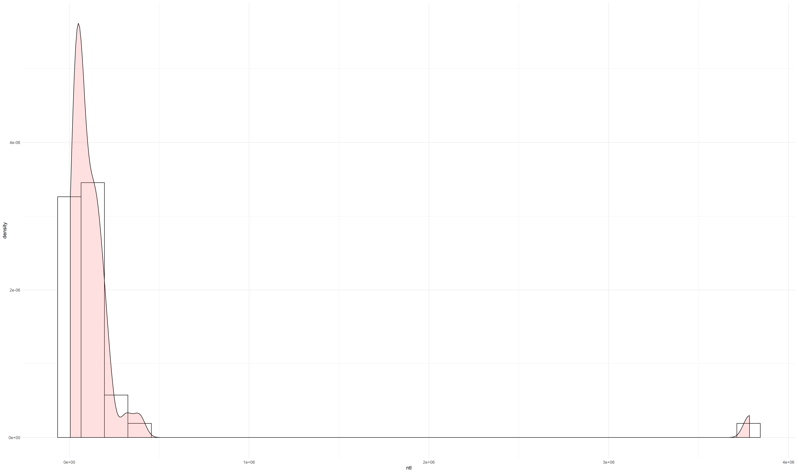
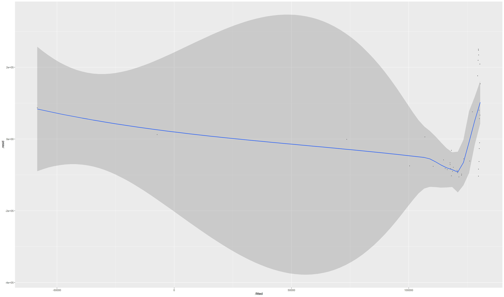
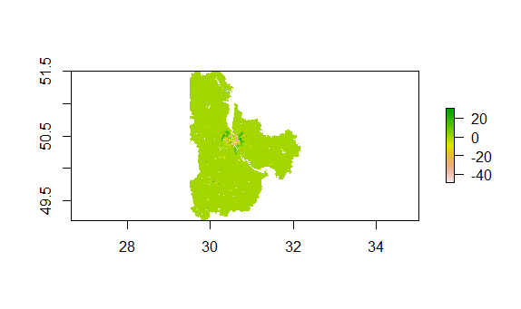

# Project 2
## Ignat Miagkov
### Part 1: Regressions

.png)
  These first three graphs are histograms combined with a distribution curve that best estimates the dependent factor based on the independent data. The first graph is the density of the population based on urban cover. The second graph is the density of the population based on night-time lights. The last graph is the density of the population based on the logarithm of the population. The last graph should have the most accurate predictor as it is making a model based directly on a population statistic.
  

[Regression Statistics](pop19_dst190_ntl.txt)
  This is a linear model predicting population density based on urban cover and night time lights. This model plots the differences (residuals) from the actual data. Regression statistics are linked in the link above. Overall, this is an okay predictor of population based on these factors in the Kiev and Kiev City districts.
  

[Regression Statistics](pop19_water_dst190_topo.txt)
  This is a linear model predicting population density based on urban cover, surrounding bodies of watre, and topography of the region. This is a much bettter predictor than the previous linear model as it uses more factors to determine and predict the density of a certain gridcell. 
  
### Part 2: Modeling and Predicting Spatial Data

