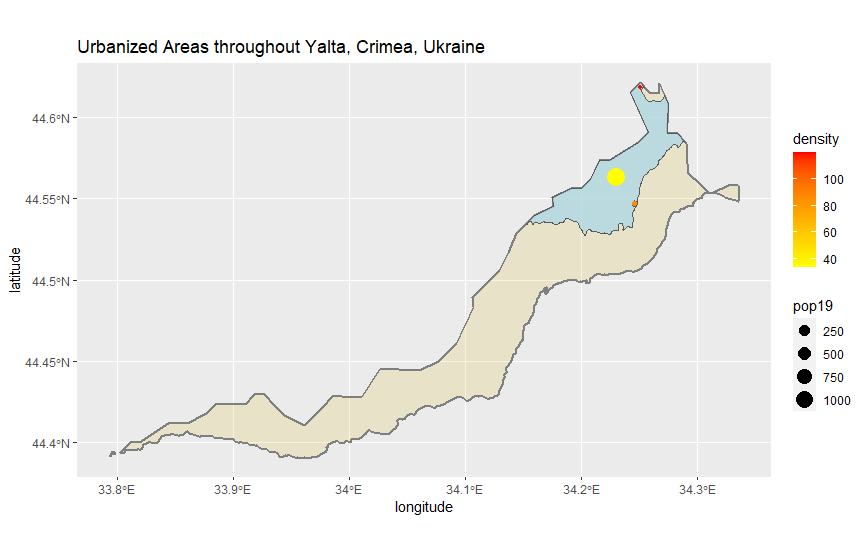

# Project 3
## Ignat Miagkov
### Part 1: Urban Areas in Yalta

  In this first part of the project, we were asked to find urbanized areas in some administrative subdiviion of our lmic. I chose Yalta, the site of one of the meetings between the big three near the conclusion of World War II. In my final effort, I was only able to produce one urbanized location according to my data. However, this area is quite small and is almost populated equally throughout, thus only producing one area that seems "urbanized", compared to the rest. For the future, I will try to use a larger area subdivision with a similar population, so that I can display more urbanized areas compared to the rest. 
  
### Part 2: Roadways and Access to Healthcare in Yalta

  I took my previous visual map of Yalta and added healthcare points and roads to it. Purple roads are primary highways, blue roads are secondary highways, and light blue roads are tertiary highways. Interestingly enough, there are no roads displayed in the urban area, and this is because all of the roads in that area are smaller roads and would not be classified as major highways. Residents of the high density area do have access to the roads, but just aren't displayed in this map because they are smaller. Different types of healthcare are displayed based on size of the green dots. Larger dots are hospitals, medium dots are doctors, and the smallest dots are all other auxillary forms of healthcare. Most of locations for healthcare are located along the major highways so that residents have easy access. The locations of the hospitals and such display that Yalta is highly developed compared to the rest of Ukraine.
