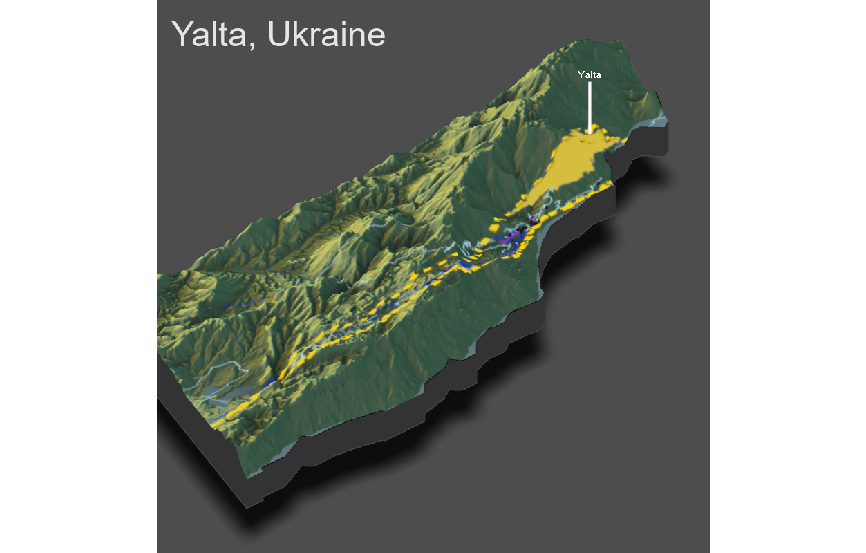

# Project 4
## Ignat Miagkov

  The first image is the outline of the borders of the Yalta subdivision in Crimea. As we can see, the subdivision is very long and narrow, and located along the coast of the Black Sea. The topography is also very mountainous: the variation is elevation is very noticable. The visual image is very cluttered due to this, and it is hard to distinguish between the different roads, so refrencing the project 3 image in conjunction with this one would be very helpful. Elevation and topography has some impact on where healthcare roads are located. Roads have to weave in between the hills, while healthcare centers have to be located in valleys compared to the peaks. This could explain why the urban center is some distance away from the healthcare centers and primary roads. Topography most definetely had an impact on the human development in Yalta.
